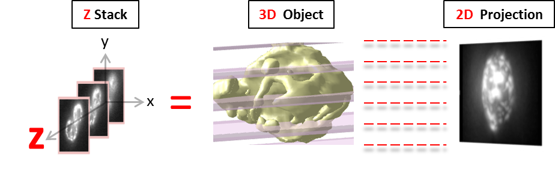
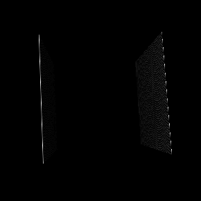
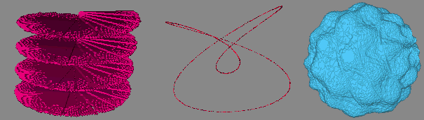
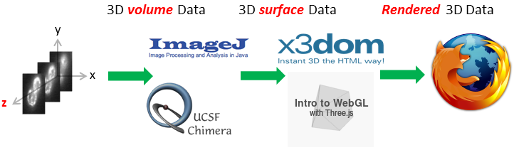

# 3D-Visualization-for-Cell-Biologists

Lecture Materials and many embedded exercises (ImageJ, UCSF Chimera, X3DOM, Three.js): This course was developed at the <a href="http://www.zmbh.uni-heidelberg.de/Central_Services/Imaging_Facility/matlab.html" target="blank">ZMBH Imaging Facility</a> (University of Heidelberg, Germany) for more efficient use and interpretation of 3D images produced therein.

 
 

</img>
 
 
</img>
 
 
</img>
 
 
</img>

